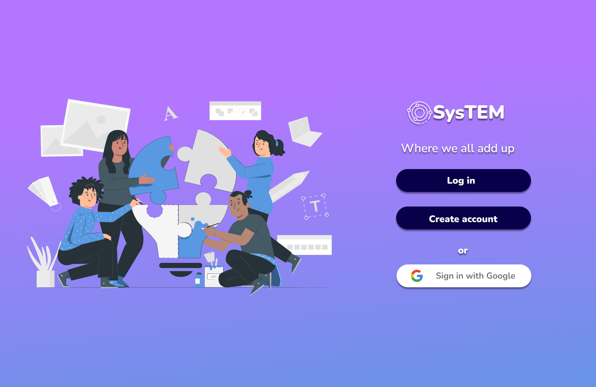
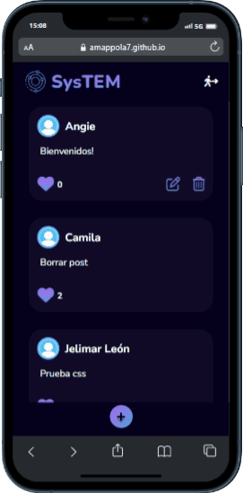

# 🪐 **SysTEM - Social Network** 🧪

## **Índice**

* [1. Introducción](#1-introducción)
 * [2. Definición de usuarios](#2-definición-de-usuarios)
* [3. Historias de usuario](#3-historias-de-usuario)
* [4. Prototipos](#4-prototipos)
* [5. Resultados de los test de usabilidad](#5-resultados-de-los-test-de-usabilidad)
* [6. Detalles técnicos](#6-Detalles-técnicos)

## **1. Introducción**
SysTEM es una red social para aficionados a las áreas STEM (ciencia, tecnología, ingeniería y matemáticas); donde los usuarios podrán:
* Ver y dar like a los posts de otros usuarios.
* Crear, editar y borrar sus propios posts.

## **2. Definición de usuarios**
Los usuarios de SysTEM son personas de entre 14 y 50 años, aficionados al mundo STEM; estudiantes, profesionales, amateurs...

El objetivo de esta red social es la de conectar a las personas interesadas en este campo y permitirles compartir contenido (memes, infografías, recursos) para que puedan así seguir disfrutando de aquello que les apasiona con personas con gustos similares.

## **3. Historias de usuario**

#### Historia de Usuario 1 
🔴 Yo como usuario quiero crear una cuenta para poder loguearme.
#### Historia de Usuario 2
🔵 Yo como usuario quiero loguearme para ingresar a la aplicación.
#### Historia de Usuario 3
🟢 Yo como usuario quiero crear y publicar un post para compartirlo.
#### Historia de Usuario 4
🟡 Yo como usuario quiero editar una publicación para corregir un error.
#### Historia de Usuario 5
🟣 Yo como usuario quiero borrar una publicación para eliminarla del muro.
#### Historia de Usuario 6
🔘 Yo como usuario quiero darle like a una publicación para expresar que me gusta.
#### Historia de Usuario 7
🟠 Yo como usuario quiero cerrar sesión para que nadie más pueda acceder.

## **4. Prototipos**
  
Puedes ver el prototipo de alta fidelidad [aquí](https://www.figma.com/file/Q12DjjRbnFTJiNU7yWEPSA/Social-Network-Laboratoria-%7C-Alta-Fidelidad?node-id=22%3A3) y el prototipo de baja fidelidad [aquí](https://www.figma.com/file/uzortbvWjDu0gNxW5rjYhg/Social-Network-Laboratoria-%7C-Baja-Fidelidad?node-id=33%3A138).
## **5. Resultados de los test de usabilidad**
Los test de usabilidad se aplicaron a nuestros usuarios objetivos, buscamos alrededor de tres personas por test. Se realizaron tanto sobre los prototipos de baja como sobre los de alta, para un total de cuatro test de usabilidad.
Los usuarios interactuaban con los prototipos según una tarea específica y luego respondían un cuestionario sobre lo que habían experimentado. 
Las recomendaciones de nuestros usuarios fueron las siguientes:
* En la esquina superior derecha poner un logo de la red social.
* En el movil y tablet el icono de cerrar sesión paso desapercibido quiza por su tamaño, quiza si es un poco mas grande es mas facil de reconocer, y con respecto al pc considero que el boton o lapiz de editar confunde al estar posicionado al lado de los likes.
* Buscar el cómo mejorar la versión Desktop (de verdad siento que el lado izquierdo es la publicidad de yahoo que ocupa media pantalla)

Sobre las recomendaciones de los usuarios iteramos los diseños hasta llegar al prototipo final. En general, la apreciación del uso de la aplicación fue bastante positiva, se identificaba de manera clara cada uno de los elementos y su funcionamiento. 
## **6. Detalles técnicos**
* Es una SPA (single page application)
* Implementa Firebase y Cloud Firestore
* Vanilla JS
* CSS3 y HTML5
* Jest

